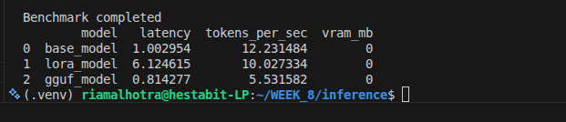

# Benchmark Report – Inference Optimization (Day-4)

## Objective

The goal of this exercise was to evaluate and compare inference performance across three model configurations:

* Base model
* Fine-tuned model (LoRA adapters)
* Quantized model (GGUF format)

The evaluation focused on measuring:

* Latency
* Token generation speed (tokens/sec)
* Memory usage (VRAM)

This benchmarking helps understand how different optimization strategies affect model inference performance.

---

## Models Tested

### 1. Base Model

The original **TinyLlama-1.1B-Chat** model loaded directly from Hugging Face without any modifications.

### 2. Fine-Tuned Model (LoRA)

The base model combined with LoRA adapters trained in Day-2.
LoRA introduces additional adapter layers which allow task-specific learning while keeping most of the base model frozen.

### 3. Quantized Model (GGUF)

A quantized version of the model converted to GGUF format and executed using llama.cpp.
Quantization reduces model size and memory requirements by lowering numerical precision.

---

## Benchmark Methodology

Each model was evaluated using the same prompt set.
The benchmarking script measured:

* **Latency** – total time required to generate output
* **Tokens per second** – generation speed
* **VRAM usage** – GPU memory usage during inference

Testing included:

* Single prompt inference
* Batch inference
* Multi-prompt evaluation
* Streaming output mode

---

## Benchmark Results



---

## Observations

* The **base model** achieved the highest token generation speed.
* The **LoRA fine-tuned model** showed slightly slower inference due to the additional adapter layers introduced during fine-tuning.
* The **GGUF quantized model** demonstrated the lowest latency but slower token generation speed when running on CPU.
* VRAM usage remained **0 MB** because the experiments were executed on CPU rather than GPU.

---

## Conclusion

This benchmarking experiment demonstrates how different optimization techniques influence inference performance:

* **LoRA fine-tuning** improves model adaptability but may slightly increase inference overhead.
* **Quantization** significantly reduces model size and startup latency.
* **Base models** typically maintain the highest raw generation speed.

These trade-offs are important when selecting models for real-world deployment where speed, memory usage, and accuracy must be balanced.

---

## Generated Artifacts

The following files were produced during this exercise:

```
/benchmarks/results.csv
/inference/test_inference.py
BENCHMARK-REPORT.md
```

