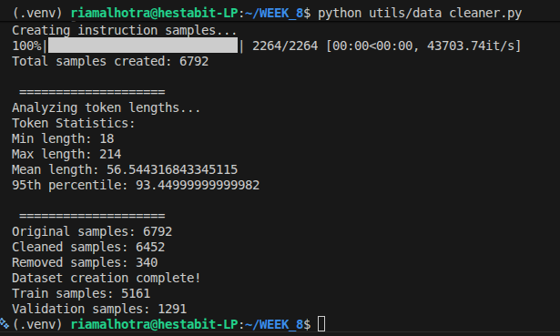

# DATASET-ANALYSIS.md

## 1. Domain Selection

The selected domain for instruction tuning is **Finance**.

The dataset was built using the Financial PhraseBank dataset, which contains human-annotated financial news sentences labeled with sentiment (positive, neutral, negative). This dataset is widely used for financial NLP benchmarking.

---

## 2. Dataset Construction Pipeline

All preprocessing steps were implemented inside a single script:

utils/data_cleaner.py

The pipeline performs the following steps:

- Load Financial PhraseBank dataset
- Generate instruction-style samples
- Perform token length analysis
- Remove outliers (95th percentile filtering)
- Split into train and validation sets
- Save final JSONL files

No intermediate files are stored. The script produces only final cleaned datasets.

---

## 3. Instruction Design

Each financial sentence was converted into three instruction formats:

### 1. Question Answering (QA)
- Task: Classify sentiment of financial statement
- Output: positive / neutral / negative

### 2. Reasoning
- Task: Classify sentiment and provide explanation
- Output: Sentiment + brief reasoning

### 3. Extraction
- Task: Extract key financial insight
- Output: Summary of financial outlook

This increases task diversity and improves instruction-following behavior.

---

## 4. Dataset Size

Initial Financial PhraseBank sentences: 2264

After generating 3 instruction types per sentence:

Total instruction samples created: 6792

After token-based outlier removal:

- Cleaned samples: 6452
- Removed samples: 340 (~5%)

Final split:

- Training samples: 5161
- Validation samples: 1291

---

## 5. Token Length Analysis

Tokenizer used:

TinyLlama-1.1B-Chat-v1.0 tokenizer

Token statistics across all instruction samples:

- Minimum length: 18 tokens
- Maximum length: 214 tokens
- Mean length: 56.54 tokens
- 95th percentile: ~93 tokens

---

## 6. Outlier Removal Strategy

To ensure stable fine-tuning and memory efficiency:

- Samples above the 95th percentile (93 tokens) were removed.
- This removed 340 long samples (~5% of total).
- The final dataset maintains compact sequence lengths.

Benefits:

- Lower GPU memory usage
- Faster training
- More stable gradients
- Reduced risk of truncation

---

## 7. Final Deliverables

The final submission contains:

data/train.jsonl  
data/val.jsonl  
utils/data_cleaner.py  
DATASET-ANALYSIS.md  

The dataset is:

- Domain-specific (Finance)
- Instruction-formatted
- Token-analyzed
- Outlier-filtered
- Properly split
- Ready for LoRA fine-tuning

**Output**

