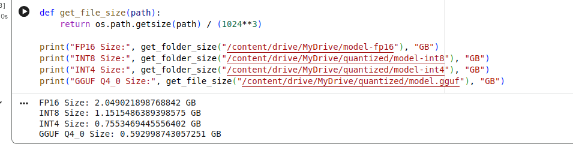
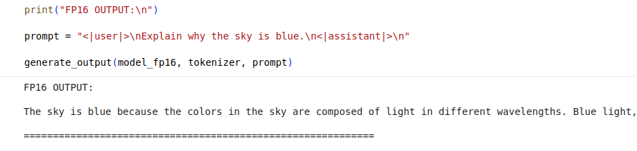
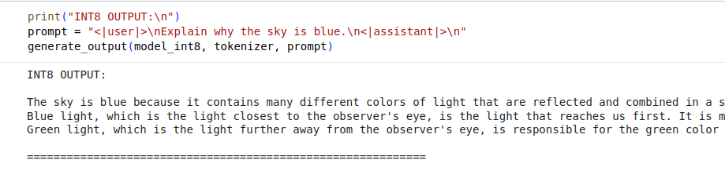
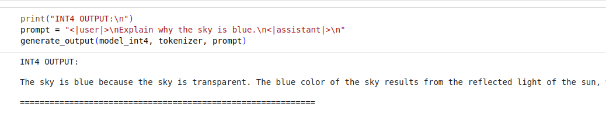
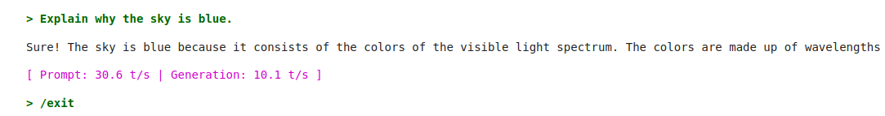

# QUANTISATION-REPORT.md

## DAY 3 — Model Quantisation (FP16 → INT8 → INT4 → GGUF)

---

## Objective

Convert a full-precision FP16 model into lower-precision formats and evaluate the trade-offs between:

* Model size
* Inference speed
* Output quality

Quantization formats tested:

* FP16 (baseline)
* INT8
* INT4 (NF4)
* GGUF (Q4_0)

---

## Model

Base model used:

TinyLlama-1.1B-Chat-v1.0

---

## Environment

* Platform: Google Colab
* GPU: NVIDIA T4

Libraries used:

* transformers
* bitsandbytes
* accelerate

GGUF inference executed using:

llama.cpp

---

## Models Generated

```
/model-fp16
/quantized/model-int8
/quantized/model-int4
/quantized/model.gguf
```

---

## Model Size Comparison

| Format    | Size (GB) |
| --------- | --------- |
| FP16      | 2.049     |
| INT8      | 1.151     |
| INT4      | 0.755     |
| GGUF Q4_0 | 0.593     |

**Observation**

* INT8 reduces size by ~44%
* INT4 reduces size by ~63%
* GGUF reduces size by ~71%

---

**Screenshot— Model Size Output**



---

## Inference Speed

Prompt used:

```
Explain why the sky is blue.
```

| Format | Time (seconds) |
| ------ | -------------- |
| FP16   | 0.926          |
| INT8   | 1.058          |
| INT4   | 0.088          |

**Observation**

* INT4 produced the fastest inference.
* INT8 was slightly slower than FP16 due to quantization overhead.

---

## GGUF Runtime Performance

| Metric            | Value           |
| ----------------- | --------------- |
| Prompt Processing | 30.6 tokens/sec |
| Generation Speed  | 10.1 tokens/sec |

---

## Output Quality

Prompt:

```
Explain why the sky is blue.
```

* **FP16** → most coherent explanation
* **INT8** → very similar to FP16
* **INT4** → slight degradation but still understandable
* **GGUF** → acceptable output for compressed model

---

**Screenshot— Output Comparison**

1. FP16 OUTPUT



2. INT8 OUTPUT



3. INT4 OUTPUT



4. GGUF OUTPUT



---

## Conclusion

Quantization significantly reduces model size while maintaining usable output quality.

Trade-off summary:

```
Lower Precision → Smaller Model → Faster Inference → Slight Quality Loss
```

Deployment suitability:

* **FP16** → training / highest accuracy
* **INT8** → balanced performance
* **INT4** → fastest GPU inference
* **GGUF** → optimized for CPU inference

---

## Final Summary

| Metric            | Best |
| ----------------- | ---- |
| Smallest Model    | GGUF |
| Fastest Inference | INT4 |
| Best Quality      | FP16 |
