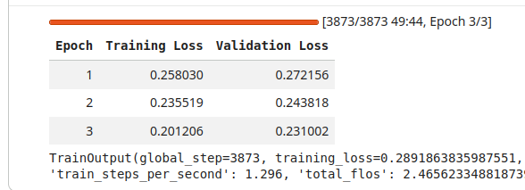

# TRAINING-REPORT.md

## Objective
Fine-tune a pretrained causal language model using QLoRA (Quantized Low-Rank Adaptation) for memory-efficient parameter-efficient fine-tuning.

---

## Training Configuration

- Quantization: 4-bit (BitsAndBytes)
- LoRA Rank (r): 16
- LoRA Alpha: 32
- LoRA Dropout: 0.05
- Learning Rate: 2e-4
- Batch Size: 4
- Epochs: 3
- Max Sequence Length: 256
- Gradient Checkpointing: Enabled
- Mixed Precision: Enabled

---

## Parameter Efficiency

- Base model weights frozen
- Only LoRA adapter layers trained
- Trainable parameters ≈ 0.2–1% of total model parameters

This confirms successful parameter-efficient fine-tuning.

---

## Training Results

Training was completed for 3 epochs. Both training and validation loss decreased consistently, indicating stable optimization and good generalization.

---

## Output Artifacts

Saved directory:

/adapters/

Contains:
- adapter_model.bin
- adapter_config.json
- tokenizer files

Adapter weights can be reloaded with the base model for inference.

---

## Conclusion

QLoRA fine-tuning was successfully implemented with:

- 4-bit model loading
- LoRA rank 16
- Learning rate 2e-4
- Batch size 4
- 3 training epochs
- ~1% trainable parameters
- Adapter weights saved

This demonstrates efficient large language model fine-tuning under constrained GPU memory conditions.